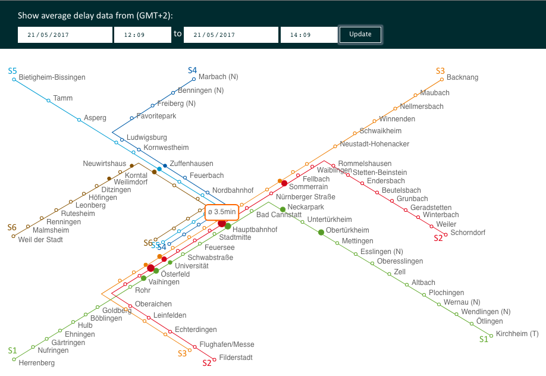

# vvs-visuals

For the course **"Software Development for Cloud Computing"** in summer 2017, we – a team of three – worked on a project called *vvs-delay*. The concept and execution are described in detail in this [blog post](https://blog.mi.hdm-stuttgart.de/index.php/2017/09/02/vvs-delay-ai-in-the-cloud/). I'll try to sum it up really quickly here, describe what this repo has to do with it and what I learned from it.

### The Parent Project
The idea was inspired by our daily struggle with the local public transport system [VVS (Verkehrsverbund Stuttgart)](http://www.vvs.de/) on one hand, and [Google Maps' traffic prediction](http://www.igismap.com/know-live-congestion-or-future-traffic-on-google-map-desktop-and-mobile/) on the other. We wanted to create a service that doesn't only inform the user about current train delays, but also **predicts delays** in the future. At least that was the greater vision. Unfortunately we didn't have enough time to get to the machine learning part, but had to leave it at step one – the collection of data.  
So the main part of our project was:
* [vvs-delay](https://github.com/jhertfe/vvs-delay): A **python app running in the cloud** (IBM Bluemix), constantly fetching real-time data from the [VVS API](https://www3.vvs.de/mng/#!/XSLT_TRIP_REQUEST2@init) and feeding it into a Cloudant database.

Along with it we implemented three complementary services, of which the latter two fell into my responsibility:
* [vvs-learning-statistical](https://github.com/Bennri/vvs-delay-learning/tree/master/vvs-learning-statistical): Purposed to retrieve some statistical information about past delays, as a first step towards machine learning.
* [vvs-delay-api](https://github.com/elisae/vvs-delay-api): To process the raw Cloudant data and make it available for other services in a more useful form.
* [vvs-visuals](https://github.com/elisae/vvs-visuals): Explained in the following.

### Data Visualization
As we had a growing amount of data sitting in the cloud, the more important it became to *understand* it. We wanted to have an easy way to interact with it during development. So even though we were still far from a functional prediction app (which would require a user-friendly graphical interface anyway) – it was necessary to create an intuitive representation of all the delay information we had collected.

**And that's what this project does.**

What you see is a depiction of the VVS transit net. The size of the circle at each station represents the "current" delay there, whereas "current" refers to the currently selected time interval – on average. White circles indicate missing data for the respective station. Hovering over a circle reveals the numerical value.  
The graphic is fully responsive; rendered dynamically with the help of **d3.js** and **SVG**.

Unfortunately, all of our cloud services, including the API for data retrieval, have been shut down; otherwise you could see it [in action](https://elisae.github.io/vvs-visuals/).

### Lessons Learned
* The cloud can be a hassle, especially Bluemix and its GUI
* How **CI/CD pipelines** work
* The importance of the environment
* Key-value-stores should be used as such (ask me about details if you like)
* You can't just throw AI at anything you want
* A little bit about **Cloudant Query selectors**, **Cloud Foundry**, RESTful API specification with **Swagger**
* A lot about **data-driven documents**, AKA the best thing ever
* VVS trains are late *a lot*  

---

> **Disclaimer**  
> This is not considered "production-ready" code, neither are the other project parts mentioned above. The main purpose, after all, was to *learn*.